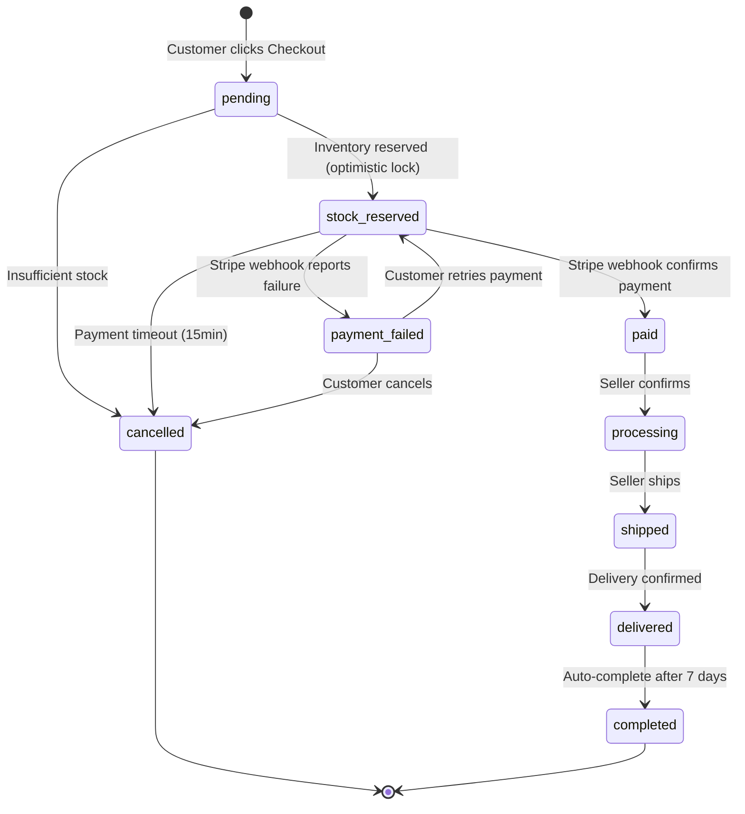

<p align="center">
  
  
  
  
  
  
  
  
</p>

# Ordex — Event-driven E-Commerce Backend

> **A production-grade, backend-heavy e-commerce platform built from scratch as a deep-dive learning project.**
> Every line of code is hand-typed. Every architectural decision is documented and defensible.

---

## What Is Ordex?

Ordex is **not** a typical CRUD e-commerce app. It's a **Modular Monolith** backend designed with the same rigor you'd expect from a real payment-critical system — focusing on **order processing pipelines, inventory concurrency control, payment integration, and event-driven architecture**.

The goal is **depth over breadth**: fewer features, but each one is production-grade — built with retry mechanisms, idempotency locks, dead-letter handling, structured logging, and compensation transactions.

---

### Why This Project Exists

This project was built as a deliberate engineering exercise with a strict rule: **100% hand-typed code, zero copy-paste**. AI tools were used exclusively as a **mentor** — for architecture reviews, Socratic questioning, and catching blind spots — never for generating business logic. Every design decision can be traced back to a documented rationale (see [ADRs](#-architecture-decision-records)).

---

## Order Lifecycle — State Machine



> Full event flows & sequence diagrams: [`docs/event-flows.md`](docs/event-flows.md)

---

## Documentation Index

| Document                                                 | Description                                                  |
| -------------------------------------------------------- | ------------------------------------------------------------ |
| [`docs/architecture.md`](docs/architecture.md)           | System architecture, module breakdown, tech stack rationale  |
| [`docs/database-design.md`](docs/database-design.md)     | Full ERD, 20+ table specifications, design patterns          |
| [`docs/api-specification.md`](docs/api-specification.md) | REST API contracts, request/response shapes                  |
| [`docs/event-flows.md`](docs/event-flows.md)             | State machines, sequence diagrams, BullMQ queue config, Saga |
| [`docs/roadmap.md`](docs/roadmap.md)                     | 10-week implementation plan with Definition of Done          |
| [`docs/adr/`](docs/adr/)                                 | Architecture Decision Records                                |
| [`docs/dev-logs/`](docs/dev-logs/)                       | Weekly development journals                                  |

---

## Technical Highlights

These aren't checklist items — they're real engineering problems I encountered, debugged, and solved. Each one has a story in the [dev logs](#-development-logs).

### Concurrency & Data Integrity

- **Optimistic Locking** on inventory with version column — prevents overselling under concurrent purchases. Tested with 5 simultaneous requests competing for 2 stock items.
- **Jitter Backoff Retry** — randomized retry delays to avoid Thundering Herd when multiple transactions conflict.
- **`Prisma.Decimal`** for all financial calculations — eliminated floating-point precision bugs (`0.1 + 0.2 ≠ 0.3` problem).

### Idempotency & Distributed Safety

- **3-Step Atomic Idempotency Lock** on the checkout endpoint:
  1. **Claim Lock** — `INSERT` a placeholder row with unique constraint; catch `P2002` to detect duplicates.
  2. **Execute Business Logic** — reserve stock, create payment, clear cart. On failure: delete the lock so retries can proceed.
  3. **Best-effort Persist** — update the lock with the cached response. On failure: **do NOT delete the lock** (prevents double-charge).
- **Scoped `try/catch` by risk** — isolated the idempotency `P2002` handler from business-logic unique constraints to avoid misidentifying errors.

### Payment Integration

- **Strategy Pattern** — `PaymentProviderInterface` → `StripePaymentProvider`. Adding VNPay or Momo requires zero changes to `OrderService`.
- **Zero-decimal currency handling** — VND, JPY, KRW bypass the `×100` conversion that Stripe requires for USD/EUR.
- **Stripe Webhook signature verification** with idempotency key deduplication.

### Checkout Pipeline (Synchronous Orchestration)

- **Compensating Transaction (Saga)** — if Stripe fails after stock is reserved, the system automatically releases inventory and cancels the order.
- **Cart deletion ordering** — cart is cleared _before_ calling Stripe (not after) to prevent financial inconsistency if a post-payment DB write fails. Documented in [ADR-008](docs/adr/008-cart-deletion-before-payment-intent.md).
- **Safe Failure Mode** — after checkout succeeds, even if persisting the idempotency cache fails, the system never deletes the lock. A retry gets blocked with "please try again later" rather than risking a double-charge.

### Auth & Security

- **JWT Refresh Token Rotation** with family-based reuse detection — if a stolen token is replayed, the entire token family is revoked.
- **RBAC** with `@Roles()` decorator — buyer, seller, admin.
- **Redis sliding-window rate limiting** per user/IP.

---

## Architecture Overview

**Modular Monolith** — each business domain is an independent NestJS module communicating through well-defined interfaces and an event bus (BullMQ). The architecture is designed so that any module can be extracted into a standalone microservice without significant refactoring.

```
┌──────────────────────────────────────────────────────────────────┐
│                     NestJS Application                           │
│                                                                  │
│  ┌────────────────────────────────────────────────────────────┐  │
│  │                  API Gateway Layer                         │  │
│  │    Guards (Auth, RBAC) · Interceptors · Pipes · Middleware │  │
│  └────────────────────────────────────────────────────────────┘  │
│                                                                  │
│  ┌──────┐ ┌──────┐ ┌──────────┐ ┌───────┐ ┌───────┐ ┌───────┐    │
│  │ Auth │ │ User │ │ Product  │ │ Order │ │ Pay-  │ │Notify │    │
│  │      │ │      │ │& Inven-  │ │ (CORE)│ │ ment  │ │       │    │
│  │      │ │      │ │  tory    │ │       │ │       │ │       │    │
│  └──────┘ └──────┘ └──────────┘ └───────┘ └───────┘ └───────┘    │
│                                                                  │
│  ┌────────────────────────────────────────────────────────────┐  │
│  │              Event Bus (BullMQ + Redis)                    │  │
│  └────────────────────────────────────────────────────────────┘  │
└──────────────┬─────────────────────────────┬─────────────────────┘
               │                             │
               ▼                             ▼
  ┌────────────────────────┐    ┌────────────────────────────┐
  │     PostgreSQL 16      │    │         Redis 7+           │
  │     (Prisma ORM)       │    │  Cache · Queue · Sessions  │
  └────────────────────────┘    └────────────────────────────┘
```

> Full architecture details: [`docs/architecture.md`](docs/architecture.md)

---

## Database Design

20+ tables across 10 domain areas, designed with real-world patterns:

| Pattern                | Where                                          | Why                                                                     |
| ---------------------- | ---------------------------------------------- | ----------------------------------------------------------------------- |
| **Snapshot Pattern**   | `orders.shipping_address`, `order_items.price` | Freeze data at order time — address/price changes don't corrupt history |
| **Optimistic Locking** | `inventory.version`                            | Concurrent stock updates without DB-level row locks                     |
| **Idempotency Keys**   | `idempotency_keys` table                       | Prevent duplicate order creation and webhook double-processing          |
| **State Machine**      | `orders.status` + `order_status_history`       | Enforced transitions with full audit trail                              |
| **Soft Delete**        | `products.is_deleted`                          | Preserve referential integrity for historical orders                    |

> Full schema: [`docs/database-design.md`](docs/database-design.md)

---

## Project Structure

```
ordex/
├── api/                          # NestJS Backend
│   ├── prisma/                   # Schema & Database Migrations
│   └── src/
│       ├── common/               # Shared utilities, decorators, filters, guards
│       │   ├── decorators/       # @Public(), @Roles(), @CurrentUser()
│       │   ├── exceptions/       # InsufficientStockException, etc.
│       │   ├── filters/          # Global exception filter
│       │   ├── guards/           # AuthGuard, RolesGuard
│       │   ├── interceptors/     # Logging, performance
│       │   └── utils/            # Order number generator, etc.
│       ├── config/               # Environment configuration
│       ├── modules/
│       │   ├── auth/             # JWT, OAuth, refresh token rotation
│       │   ├── user/             # Profile, address management
│       │   ├── category/         # Nested category tree
│       │   ├── product/          # CRUD, variants, image upload
│       │   ├── inventory/        # Stock reservation, optimistic locking
│       │   ├── cart/             # Cart management
│       │   ├── order/            # Checkout pipeline, state machine (CORE)
│       │   ├── payment/          # Strategy Pattern, Stripe integration
│       │   ├── notification/     # Async email/Telegram (BullMQ)
│       │   └── analytics/        # Revenue aggregation
│       ├── prisma/               # PrismaService wrapper
│       └── storage/              # Cloudflare R2 / S3 abstraction
├── docs/                         # Engineering documentation
│   ├── architecture.md           # System architecture & module breakdown
│   ├── database-design.md        # Full ERD + table specs + design patterns
│   ├── api-specification.md      # REST API endpoints & contracts
│   ├── event-flows.md            # State machines, sequence diagrams, Saga
│   ├── roadmap.md                # Week-by-week implementation plan
│   ├── adr/                      # Architecture Decision Records
│   └── dev-logs/                 # Weekly development journals
└── docker-compose.yml            # PostgreSQL + Redis
```

---

## Tech Stack

| Layer             | Technology          | Why                                                               |
| ----------------- | ------------------- | ----------------------------------------------------------------- |
| **Runtime**       | Node.js 20+         | LTS, native NestJS support                                        |
| **Framework**     | NestJS              | Modular DI, Guards/Interceptors/Pipes ecosystem                   |
| **Language**      | TypeScript (strict) | End-to-end type safety                                            |
| **ORM**           | Prisma              | Type-safe queries, migration workflow                             |
| **Database**      | PostgreSQL 16       | Production RDBMS, full-text search (tsvector)                     |
| **Cache & Queue** | Redis 7+ / BullMQ   | Job queue with retry, backoff, DLQ, cron scheduling               |
| **Auth**          | Passport.js + JWT   | Access/refresh token rotation, Google OAuth 2.0                   |
| **Payment**       | Stripe SDK          | Strategy Pattern — swap providers without touching business logic |
| **Storage**       | Cloudflare R2       | S3-compatible, zero egress fees                                   |
| **Logging**       | Winston             | Structured JSON logging with correlation IDs                      |
| **Container**     | Docker Compose      | PostgreSQL + Redis + App in one command                           |

---

## 🗺 Roadmap

| Phase | Weeks | Focus                          |
| ----- | ----- | ------------------------------ |
| 0     | 1     | Architecture & Foundation      |
| 1     | 2     | Auth Module                    |
| 2     | 3–4   | Product & Inventory            |
| 3     | 5–6   | Order + Payment (CORE)         |
| 4     | 7     | Notification + Caching         |
| 5     | 8     | Analytics + Admin Dashboard    |
| 6     | 9     | Testing + Security Hardening   |
| 7     | 10    | Deploy + CI/CD + Documentation |

> Full details: [`docs/roadmap.md`](docs/roadmap.md)

---

## Engineering Philosophy

1. **Depth over Breadth** — ADRs documenting trade-offs is worth more than CRUD endpoints.
2. **No Magic** — Every pattern (optimistic lock, saga compensation, idempotency) is implemented from scratch to understand the mechanics, not hidden behind a library.
3. **Document the "Why"** — Code comments explain _why_, not _what_. ADRs capture decisions so future-me doesn't re-debate them.
4. **Fail Safe, Not Fail Fast** — When a system handles real money, the question isn't "what happens when it works?" but "what's the safest thing to do when it breaks at line 217?"
5. **SOLID as a Reflex** — DIP via provider tokens, OCP via Strategy Pattern, SRP via module boundaries — not as theory, but as daily practice.

---

<p align="center">
  <i>Ordex Backend Engineering — Built for reliability and performance.</i>
</p>
