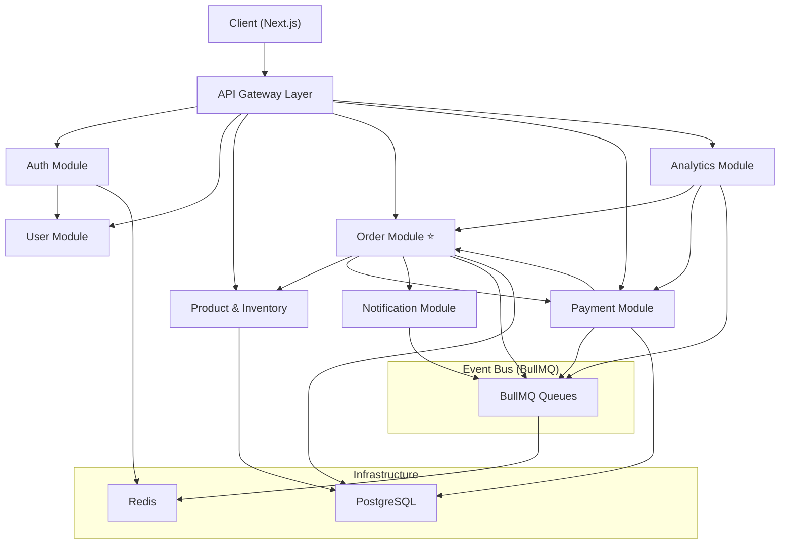

# Ordex — System Architecture

> Event-driven E-Commerce Platform | NestJS Modular Monolith

## 1. Overview

Ordex là một nền tảng e-commerce backend-heavy, thiết kế theo kiến trúc **Modular Monolith** trên NestJS. Trọng tâm của hệ thống không phải giao diện bán hàng, mà là **order processing pipeline, inventory management, payment handling**, và **event-driven communication** giữa các module.

### Design Principles

- **Modular Monolith:** Mỗi domain là một NestJS Module độc lập, giao tiếp qua Event Bus (BullMQ/EventEmitter). Có thể tách thành microservice sau mà không refactor lớn.
- **Event-driven:** Các business flow quan trọng (order, payment, notification) xử lý async qua BullMQ job queue.
- **Depth over Breadth:** Ít feature nhưng mỗi cái đều production-grade: retry, idempotency, dead letter queue, structured logging.
- **Payment Provider Agnostic:** Hỗ trợ nhiều provider (Stripe, VNPay) qua Strategy Pattern.

---

## 2. High-Level Architecture

```
┌──────────────────────────────────────────────────────────────────┐
│                        Client Layer                              │
│                                                                  │
│   ┌──────────────────┐         ┌────────────────────────┐        │
│   │  Next.js Admin   │         │  Next.js Storefront    │        │
│   │  Dashboard       │         │  (Phase 2)             │        │
│   └────────┬─────────┘         └──────────┬─────────────┘        │
│            │                              │                      │
└────────────┼──────────────────────────────┼──────────────────────┘
             │           REST API           │
             ▼                              ▼
┌──────────────────────────────────────────────────────────────────┐
│                     NestJS Application                           │
│                                                                  │
│  ┌────────────────────────────────────────────────────────────┐  │
│  │                  API Gateway Layer                         │  │
│  │  ┌────────────┐ ┌──────────────┐ ┌────────┐ ┌────────────┐ │  │
│  │  │  Guards    │ │ Interceptors │ │ Pipes  │ │ Middleware │ │  │
│  │  │(Auth,RBAC) │ │(Logging,Perf)│ │(Valid.)│ │(RateLimit) │ │  │
│  │  └────────────┘ └──────────────┘ └────────┘ └────────────┘ │  │
│  └────────────────────────────────────────────────────────────┘  │
│                                                                  │
│  ┌──────┐ ┌──────┐ ┌──────────┐ ┌───────┐ ┌───────┐ ┌───────┐    │
│  │ Auth │ │ User │ │ Product  │ │ Order │ │ Pay-  │ │ Noti- │    │
│  │Module│ │Module│ │& Inven-  │ │Module │ │ ment  │ │ fica- │    │
│  │      │ │      │ │  tory    │ │(CORE) │ │Module │ │ tion  │    │
│  └──┬───┘ └──┬───┘ └────┬─────┘ └───┬───┘ └───┬───┘ └───┬───┘    │
│     │        │          │           │         │         │        │
│  ┌──┴────────┴──────────┴───────────┴─────────┴─────────┴────┐   │
│  │            Analytics Module (Background Jobs)             │   │
│  └───────────────────────────────────────────────────────────┘   │
│                                                                  │
│  ┌────────────────────────────────────────────────────────────┐  │
│  │              Event Bus (BullMQ + EventEmitter)             │  │
│  └────────────────────────────────────────────────────────────┘  │
│                                                                  │
└──────────────┬─────────────────────────────┬─────────────────────┘
               │                             │
               ▼                             ▼
  ┌────────────────────────┐   ┌────────────────────────────┐
  │     PostgreSQL         │   │     Redis                  │
  │  ┌─────────────────┐   │   │  ┌────────────────────┐    │
  │  │  Main Database  │   │   │  │  Cache Layer       │    │
  │  │  (Prisma ORM)   │   │   │  │  Session Store     │    │
  │  │  + pgvector     │   │   │  │  Rate Limiter      │    │
  │  └─────────────────┘   │   │  │  BullMQ Queues     │    │
  └────────────────────────┘   │  └────────────────────┘    │
                               └────────────────────────────┘
```

---

## 3. Module Breakdown

### 3.1 Auth Module

| Aspect         | Detail                                                                           |
| -------------- | -------------------------------------------------------------------------------- |
| Responsibility | Authentication, authorization, token management                                  |
| Key Features   | JWT access + refresh token rotation, Google OAuth 2.0, RBAC (buyer/seller/admin) |
| Dependencies   | User Module, Redis (token blacklist, rate limit)                                 |
| Exports        | `AuthGuard`, `RolesGuard`, `CurrentUser` decorator                               |

### 3.2 User Module

| Aspect         | Detail                                                |
| -------------- | ----------------------------------------------------- |
| Responsibility | User profile, seller onboarding                       |
| Key Features   | Profile CRUD, seller verification, address management |
| Dependencies   | Auth Module                                           |

### 3.3 Product & Inventory Module

| Aspect           | Detail                                                                                                      |
| ---------------- | ----------------------------------------------------------------------------------------------------------- |
| Responsibility   | Product catalog, stock management                                                                           |
| Key Features     | Product CRUD + variants, category tree, image upload (Cloudflare R2), stock reservation, optimistic locking |
| Dependencies     | Auth Module                                                                                                 |
| Events Published | `StockReserved`, `StockReleased`, `StockDepleted`                                                           |

### 3.4 Order Module (CORE)

| Aspect           | Detail                                                                                                                  |
| ---------------- | ----------------------------------------------------------------------------------------------------------------------- |
| Responsibility   | Order lifecycle, state machine, event orchestration                                                                     |
| Key Features     | Cart → Checkout → Order pipeline, state machine (pending→confirmed→paid→shipped→completed/cancelled), Saga coordination |
| Dependencies     | Product/Inventory, Payment, Notification                                                                                |
| Events Published | `OrderCreated`, `OrderConfirmed`, `OrderCancelled`, `OrderShipped`, `OrderCompleted`                                    |
| Events Consumed  | `PaymentSucceeded`, `PaymentFailed`, `StockReserved`, `StockInsufficient`                                               |

### 3.5 Payment Module

| Aspect           | Detail                                                                                                                            |
| ---------------- | --------------------------------------------------------------------------------------------------------------------------------- |
| Responsibility   | Payment processing, webhook handling                                                                                              |
| Key Features     | Multi-provider (Stripe + VNPay) via Strategy Pattern, webhook handler + idempotency key, payment status tracking, simulation mode |
| Dependencies     | Order Module                                                                                                                      |
| Events Published | `PaymentSucceeded`, `PaymentFailed`, `PaymentRefunded`                                                                            |
| Design Pattern   | **Strategy Pattern** — `PaymentProviderInterface` → `StripeProvider`, `VNPayProvider`                                             |

### 3.6 Notification Module

| Aspect          | Detail                                                                                                                 |
| --------------- | ---------------------------------------------------------------------------------------------------------------------- |
| Responsibility  | Async notification delivery                                                                                            |
| Key Features    | Multi-channel (Email via Resend.com, Telegram Bot), BullMQ async processing, scheduled jobs (reminders, daily reports) |
| Events Consumed | `OrderConfirmed`, `OrderShipped`, `PaymentSucceeded`, `PaymentFailed`                                                  |
| Future          | Candidate for extraction to standalone microservice                                                                    |

### 3.7 Analytics Module

| Aspect         | Detail                                                                             |
| -------------- | ---------------------------------------------------------------------------------- |
| Responsibility | Business metrics aggregation                                                       |
| Key Features   | Background scheduled jobs (BullMQ cron), revenue/day, best-seller, conversion rate |
| Dependencies   | Order, Payment data                                                                |

---

## 4. Tech Stack

| Layer                | Technology                          | Rationale                                                       |
| -------------------- | ----------------------------------- | --------------------------------------------------------------- |
| **Runtime**          | Node.js 20+                         | LTS, NestJS native                                              |
| **Framework**        | NestJS 10+                          | Modular, DI built-in, Guards/Interceptors/Pipes, BullMQ support |
| **Language**         | TypeScript 6+                       | Type safety, shared types FE/BE                                 |
| **ORM**              | Prisma                              | Type-safe queries, migration workflow, DX tốt                   |
| **Database**         | PostgreSQL 16                       | Production-grade RDBMS, pgvector cho semantic search            |
| **Cache**            | Redis 7+                            | Cache, session, rate limiting, BullMQ backend                   |
| **Queue**            | BullMQ                              | Redis-based, retry/backoff, dead letter queue, cron jobs        |
| **Auth**             | Passport.js + JWT                   | NestJS ecosystem, Google OAuth strategy                         |
| **Validation**       | class-validator + class-transformer | NestJS pipes integration                                        |
| **Logging**          | Winston                             | Structured JSON logging, correlation ID                         |
| **Error Tracking**   | Sentry                              | Production error monitoring                                     |
| **File Storage**     | Cloudflare R2                       | S3-compatible, free egress                                      |
| **Email**            | Resend.com                          | Developer-friendly, free tier                                   |
| **Payment**          | Stripe SDK + VNPay API              | Strategy pattern, test/sandbox mode                             |
| **Frontend**         | Next.js 15+ (App Router)            | Admin Dashboard (Phase 1), Storefront (Phase 2)                 |
| **Containerization** | Docker + Docker Compose             | Local dev: PG + Redis + App                                     |
| **CI/CD**            | GitHub Actions                      | Lint, test, build, deploy                                       |
| **Deploy**           | Railway / VPS (Hetzner)             | Cost-effective                                                  |

---

## 5. Cross-Cutting Concerns

### 5.1 Authentication & Authorization

```
Request → RateLimitMiddleware → AuthGuard (JWT verify) → RolesGuard (RBAC check) → Controller
```

- **AuthGuard:** Verify JWT, attach user to request
- **RolesGuard:** Check `@Roles('admin', 'seller')` decorator
- **Public routes:** `@Public()` decorator to bypass auth

### 5.2 Structured Logging

- **Winston** with JSON format
- **Correlation ID:** Generated per request via middleware, propagated through all layers
- **Log levels:** `error`, `warn`, `info`, `debug`
- **Context:** Module name, method, user ID, request ID

```json
{
  "timestamp": "2026-04-15T10:30:00Z",
  "level": "info",
  "correlationId": "abc-123",
  "module": "OrderModule",
  "method": "createOrder",
  "userId": "user_456",
  "message": "Order created successfully",
  "orderId": "order_789"
}
```

### 5.3 Error Handling

- **Global Exception Filter:** Catches all unhandled exceptions
- **Business Exception classes:** `InsufficientStockException`, `PaymentFailedException`, etc.
- **Standard error response format:**

```json
{
  "statusCode": 400,
  "error": "INSUFFICIENT_STOCK",
  "message": "Product variant SKU-001 has only 2 items in stock",
  "correlationId": "abc-123",
  "timestamp": "2026-04-15T10:30:00Z"
}
```

### 5.4 Rate Limiting

- **Redis sliding window** algorithm
- Per-user and per-IP limiting
- Configurable per endpoint via decorator: `@RateLimit(100, '1m')`

### 5.5 Pagination

Standard pagination response format across all list endpoints:

```json
{
  "data": [],
  "meta": {
    "total": 150,
    "page": 1,
    "limit": 20,
    "totalPages": 8
  }
}
```

---

## 6. Module Dependency Graph



---

## 7. Phasing Strategy

### Phase 1: Backend Core (Week 1–10)

- NestJS Modular Monolith hoàn chỉnh
- Tất cả modules, event-driven pipeline, testing
- Admin Dashboard (Next.js) — quản lý đơn hàng, sản phẩm, analytics
- Deploy + Docker + CI/CD

### Phase 2: Storefront Frontend (sau Phase 1)

- Next.js App Router storefront cho buyer
- Product listing, cart, checkout UI
- Integrate với existing backend API

### Phase 3: Advanced Features (nếu còn thời gian)

- Tách Notification Module thành microservice (RabbitMQ)
- Semantic search với pgvector
- WebSocket realtime order tracking
- Multi-vendor expansion (Option A features)
