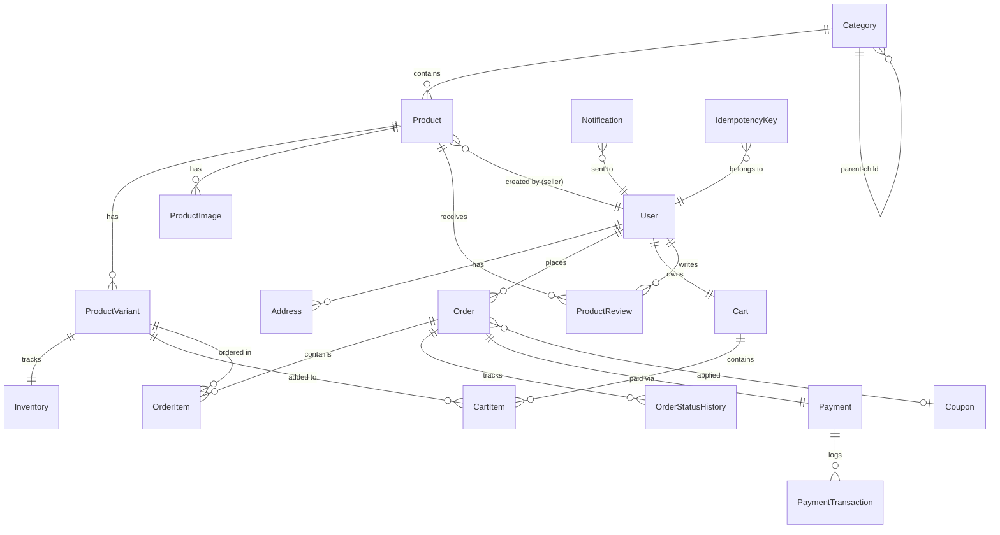

# Ordex — Database Design

> PostgreSQL Schema + ERD | Prisma ORM

## 1. Entity-Relationship Diagram



---

## 2. Tables Detail

### 2.1 User & Auth

#### `users`

| Column | Type | Constraints | Note |
|---|---|---|---|
| `id` | `UUID` | PK, default `gen_random_uuid()` | |
| `email` | `VARCHAR(255)` | UNIQUE, NOT NULL | |
| `password_hash` | `VARCHAR(255)` | NULLABLE (OAuth users) | bcrypt |
| `full_name` | `VARCHAR(100)` | NOT NULL | |
| `phone` | `VARCHAR(20)` | NULLABLE | |
| `avatar_url` | `TEXT` | NULLABLE | Cloudflare R2 URL |
| `role` | `ENUM('buyer','seller','admin')` | NOT NULL, DEFAULT 'buyer' | |
| `is_verified` | `BOOLEAN` | DEFAULT false | Email verified |
| `is_active` | `BOOLEAN` | DEFAULT true | Soft disable |
| `oauth_provider` | `VARCHAR(20)` | NULLABLE | 'google' |
| `oauth_id` | `VARCHAR(255)` | NULLABLE | Provider user ID |
| `created_at` | `TIMESTAMP` | DEFAULT NOW() | |
| `updated_at` | `TIMESTAMP` | AUTO UPDATE | |

**Indexes:**
- `UNIQUE(email)`
- `UNIQUE(oauth_provider, oauth_id)` — compound unique for OAuth
- `INDEX(role)` — filter by role

#### `refresh_tokens`

| Column | Type | Constraints | Note |
|---|---|---|---|
| `id` | `UUID` | PK | |
| `user_id` | `UUID` | FK → users, NOT NULL | |
| `token_hash` | `VARCHAR(255)` | NOT NULL | SHA-256 hash |
| `expires_at` | `TIMESTAMP` | NOT NULL | |
| `is_revoked` | `BOOLEAN` | DEFAULT false | Token rotation |
| `family_id` | `UUID` | NOT NULL | Detect token reuse |
| `created_at` | `TIMESTAMP` | DEFAULT NOW() | |

**Indexes:**
- `INDEX(token_hash)` — lookup on refresh
- `INDEX(user_id, is_revoked)` — find active tokens
- `INDEX(family_id)` — token rotation family

#### `addresses`

| Column | Type | Constraints | Note |
|---|---|---|---|
| `id` | `UUID` | PK | |
| `user_id` | `UUID` | FK → users | |
| `label` | `VARCHAR(50)` | | 'Home', 'Office' |
| `full_name` | `VARCHAR(100)` | NOT NULL | Recipient |
| `phone` | `VARCHAR(20)` | NOT NULL | |
| `address_line` | `TEXT` | NOT NULL | |
| `ward` | `VARCHAR(100)` | | |
| `district` | `VARCHAR(100)` | NOT NULL | |
| `city` | `VARCHAR(100)` | NOT NULL | |
| `is_default` | `BOOLEAN` | DEFAULT false | |
| `created_at` | `TIMESTAMP` | DEFAULT NOW() | |

---

### 2.2 Product Catalog

#### `categories`

| Column | Type | Constraints | Note |
|---|---|---|---|
| `id` | `UUID` | PK | |
| `name` | `VARCHAR(100)` | NOT NULL | |
| `slug` | `VARCHAR(120)` | UNIQUE | URL-friendly |
| `parent_id` | `UUID` | FK → categories, NULLABLE | Self-referencing tree |
| `description` | `TEXT` | NULLABLE | |
| `image_url` | `TEXT` | NULLABLE | |
| `sort_order` | `INT` | DEFAULT 0 | |
| `is_active` | `BOOLEAN` | DEFAULT true | |
| `created_at` | `TIMESTAMP` | DEFAULT NOW() | |

**Indexes:**
- `UNIQUE(slug)`
- `INDEX(parent_id)` — tree traversal

#### `products`

| Column | Type | Constraints | Note |
|---|---|---|---|
| `id` | `UUID` | PK | |
| `seller_id` | `UUID` | FK → users | Product owner |
| `category_id` | `UUID` | FK → categories | |
| `name` | `VARCHAR(255)` | NOT NULL | |
| `slug` | `VARCHAR(280)` | UNIQUE | |
| `description` | `TEXT` | | Rich text / markdown |
| `base_price` | `DECIMAL(12,2)` | NOT NULL | VND or USD |
| `currency` | `VARCHAR(3)` | DEFAULT 'VND' | |
| `status` | `ENUM('draft','active','archived')` | DEFAULT 'draft' | |
| `is_deleted` | `BOOLEAN` | DEFAULT false | Soft delete |
| `deleted_at` | `TIMESTAMP` | NULLABLE | |
| `created_at` | `TIMESTAMP` | DEFAULT NOW() | |
| `updated_at` | `TIMESTAMP` | AUTO UPDATE | |

**Indexes:**
- `UNIQUE(slug)`
- `INDEX(seller_id, status)` — seller's active products
- `INDEX(category_id, status)` — category listing
- `INDEX(status, is_deleted)` — active products filter
- `GIN INDEX(name)` — full-text search (tsvector)

#### `product_variants`

| Column | Type | Constraints | Note |
|---|---|---|---|
| `id` | `UUID` | PK | |
| `product_id` | `UUID` | FK → products | |
| `sku` | `VARCHAR(50)` | UNIQUE | Stock Keeping Unit |
| `name` | `VARCHAR(100)` | NOT NULL | 'Red / XL' |
| `price` | `DECIMAL(12,2)` | NOT NULL | Override base price |
| `attributes` | `JSONB` | | `{"color": "Red", "size": "XL"}` |
| `is_active` | `BOOLEAN` | DEFAULT true | |
| `created_at` | `TIMESTAMP` | DEFAULT NOW() | |

**Indexes:**
- `UNIQUE(sku)`
- `INDEX(product_id, is_active)`

#### `product_images`

| Column | Type | Constraints | Note |
|---|---|---|---|
| `id` | `UUID` | PK | |
| `product_id` | `UUID` | FK → products | |
| `url` | `TEXT` | NOT NULL | Cloudflare R2 |
| `alt_text` | `VARCHAR(255)` | | |
| `sort_order` | `INT` | DEFAULT 0 | |
| `is_primary` | `BOOLEAN` | DEFAULT false | |

---

### 2.3 Inventory

#### `inventory`

| Column | Type | Constraints | Note |
|---|---|---|---|
| `id` | `UUID` | PK | |
| `variant_id` | `UUID` | FK → product_variants, UNIQUE | 1:1 |
| `quantity` | `INT` | NOT NULL, DEFAULT 0 | Available stock |
| `reserved` | `INT` | NOT NULL, DEFAULT 0 | Reserved by pending orders |
| `low_stock_threshold` | `INT` | DEFAULT 5 | Alert threshold |
| `version` | `INT` | NOT NULL, DEFAULT 1 | **Optimistic locking** |
| `updated_at` | `TIMESTAMP` | AUTO UPDATE | |

**Optimistic Locking Pattern:**
```sql
UPDATE inventory
SET quantity = quantity - 1,
    reserved = reserved + 1,
    version = version + 1
WHERE variant_id = $1
  AND version = $current_version
  AND (quantity - reserved) >= 1;
-- If affected rows = 0 → conflict, retry
```

**Indexes:**
- `UNIQUE(variant_id)`
- `INDEX(quantity)` — find low stock

---

### 2.4 Cart

#### `carts`

| Column | Type | Constraints | Note |
|---|---|---|---|
| `id` | `UUID` | PK | |
| `user_id` | `UUID` | FK → users, UNIQUE | 1 cart per user |
| `updated_at` | `TIMESTAMP` | AUTO UPDATE | |

#### `cart_items`

| Column | Type | Constraints | Note |
|---|---|---|---|
| `id` | `UUID` | PK | |
| `cart_id` | `UUID` | FK → carts | |
| `variant_id` | `UUID` | FK → product_variants | |
| `quantity` | `INT` | NOT NULL, CHECK > 0 | |
| `added_at` | `TIMESTAMP` | DEFAULT NOW() | |

**Indexes:**
- `UNIQUE(cart_id, variant_id)` — no duplicate items

---

### 2.5 Order

#### `orders`

| Column | Type | Constraints | Note |
|---|---|---|---|
| `id` | `UUID` | PK | |
| `order_number` | `VARCHAR(20)` | UNIQUE | `ORD-20260415-XXXX` |
| `user_id` | `UUID` | FK → users | Buyer |
| `status` | `ENUM(...)` | NOT NULL, DEFAULT 'pending' | See state machine below |
| `subtotal` | `DECIMAL(12,2)` | NOT NULL | Before discount |
| `discount_amount` | `DECIMAL(12,2)` | DEFAULT 0 | Coupon applied |
| `shipping_fee` | `DECIMAL(12,2)` | DEFAULT 0 | |
| `total` | `DECIMAL(12,2)` | NOT NULL | Final amount |
| `coupon_id` | `UUID` | FK → coupons, NULLABLE | |
| `shipping_address` | `JSONB` | NOT NULL | Snapshot at order time |
| `note` | `TEXT` | NULLABLE | Customer note |
| `created_at` | `TIMESTAMP` | DEFAULT NOW() | |
| `updated_at` | `TIMESTAMP` | AUTO UPDATE | |

**Order Status Enum:**
```
'pending' → 'confirmed' → 'paid' → 'processing' → 'shipped' → 'delivered' → 'completed'
                ↘ 'cancelled'
'pending' → 'payment_failed'
```

**Indexes:**
- `UNIQUE(order_number)`
- `INDEX(user_id, status)` — user's orders by status
- `INDEX(status, created_at)` — admin filter
- `INDEX(created_at)` — analytics

#### `order_items`

| Column | Type | Constraints | Note |
|---|---|---|---|
| `id` | `UUID` | PK | |
| `order_id` | `UUID` | FK → orders | |
| `variant_id` | `UUID` | FK → product_variants | |
| `product_name` | `VARCHAR(255)` | NOT NULL | Snapshot |
| `variant_name` | `VARCHAR(100)` | NOT NULL | Snapshot |
| `sku` | `VARCHAR(50)` | NOT NULL | Snapshot |
| `price` | `DECIMAL(12,2)` | NOT NULL | Price at order time |
| `quantity` | `INT` | NOT NULL | |
| `subtotal` | `DECIMAL(12,2)` | NOT NULL | price × quantity |

#### `order_status_history`

| Column | Type | Constraints | Note |
|---|---|---|---|
| `id` | `UUID` | PK | |
| `order_id` | `UUID` | FK → orders | |
| `from_status` | `VARCHAR(30)` | NULLABLE | NULL for initial |
| `to_status` | `VARCHAR(30)` | NOT NULL | |
| `changed_by` | `UUID` | FK → users, NULLABLE | System or user |
| `reason` | `TEXT` | NULLABLE | Cancellation reason |
| `created_at` | `TIMESTAMP` | DEFAULT NOW() | |

**Indexes:**
- `INDEX(order_id, created_at)` — order history timeline

---

### 2.6 Payment

#### `payments`

| Column | Type | Constraints | Note |
|---|---|---|---|
| `id` | `UUID` | PK | |
| `order_id` | `UUID` | FK → orders, UNIQUE | 1 payment per order |
| `provider` | `ENUM('stripe','vnpay')` | NOT NULL | |
| `provider_payment_id` | `VARCHAR(255)` | NULLABLE | Stripe PaymentIntent ID |
| `amount` | `DECIMAL(12,2)` | NOT NULL | |
| `currency` | `VARCHAR(3)` | NOT NULL | |
| `status` | `ENUM('pending','processing','succeeded','failed','refunded')` | DEFAULT 'pending' | |
| `metadata` | `JSONB` | | Provider-specific data |
| `created_at` | `TIMESTAMP` | DEFAULT NOW() | |
| `updated_at` | `TIMESTAMP` | AUTO UPDATE | |

**Indexes:**
- `UNIQUE(order_id)`
- `UNIQUE(provider, provider_payment_id)` — prevent duplicate
- `INDEX(status)`

#### `payment_transactions`

| Column | Type | Constraints | Note |
|---|---|---|---|
| `id` | `UUID` | PK | |
| `payment_id` | `UUID` | FK → payments | |
| `type` | `ENUM('charge','refund','webhook')` | NOT NULL | |
| `status` | `VARCHAR(30)` | NOT NULL | |
| `amount` | `DECIMAL(12,2)` | | |
| `raw_response` | `JSONB` | | Full provider response |
| `created_at` | `TIMESTAMP` | DEFAULT NOW() | |

---

### 2.7 Promotion

#### `coupons`

| Column | Type | Constraints | Note |
|---|---|---|---|
| `id` | `UUID` | PK | |
| `code` | `VARCHAR(30)` | UNIQUE | 'SUMMER2026' |
| `type` | `ENUM('percentage','fixed')` | NOT NULL | |
| `value` | `DECIMAL(12,2)` | NOT NULL | 10 (%) or 50000 (VND) |
| `min_order_amount` | `DECIMAL(12,2)` | DEFAULT 0 | |
| `max_discount` | `DECIMAL(12,2)` | NULLABLE | Cap for percentage |
| `usage_limit` | `INT` | NULLABLE | Total uses allowed |
| `used_count` | `INT` | DEFAULT 0 | |
| `starts_at` | `TIMESTAMP` | NOT NULL | |
| `expires_at` | `TIMESTAMP` | NOT NULL | |
| `is_active` | `BOOLEAN` | DEFAULT true | |
| `created_at` | `TIMESTAMP` | DEFAULT NOW() | |

**Indexes:**
- `UNIQUE(code)`
- `INDEX(is_active, starts_at, expires_at)` — valid coupons

---

### 2.8 Notification

#### `notifications`

| Column | Type | Constraints | Note |
|---|---|---|---|
| `id` | `UUID` | PK | |
| `user_id` | `UUID` | FK → users | |
| `type` | `VARCHAR(50)` | NOT NULL | 'order_confirmed', 'payment_received' |
| `channel` | `ENUM('email','telegram','in_app')` | NOT NULL | |
| `title` | `VARCHAR(255)` | NOT NULL | |
| `content` | `TEXT` | NOT NULL | |
| `status` | `ENUM('pending','sent','failed')` | DEFAULT 'pending' | |
| `sent_at` | `TIMESTAMP` | NULLABLE | |
| `metadata` | `JSONB` | | Order ID, etc. |
| `created_at` | `TIMESTAMP` | DEFAULT NOW() | |

---

### 2.9 Idempotency

#### `idempotency_keys`

| Column | Type | Constraints | Note |
|---|---|---|---|
| `id` | `UUID` | PK | |
| `key` | `VARCHAR(255)` | UNIQUE | Client-provided or webhook-derived |
| `resource_type` | `VARCHAR(50)` | NOT NULL | 'payment_webhook', 'create_order' |
| `resource_id` | `UUID` | NULLABLE | Created resource ID |
| `request_hash` | `VARCHAR(64)` | | SHA-256 of request body |
| `response_code` | `INT` | | Stored response status |
| `response_body` | `JSONB` | | Stored response |
| `expires_at` | `TIMESTAMP` | NOT NULL | Auto-cleanup after 24h |
| `created_at` | `TIMESTAMP` | DEFAULT NOW() | |

**Indexes:**
- `UNIQUE(key)`
- `INDEX(expires_at)` — cleanup expired keys

---

### 2.10 Audit

#### `audit_logs`

| Column | Type | Constraints | Note |
|---|---|---|---|
| `id` | `UUID` | PK | |
| `user_id` | `UUID` | FK → users, NULLABLE | System actions = NULL |
| `action` | `VARCHAR(50)` | NOT NULL | 'order.created', 'product.updated' |
| `entity_type` | `VARCHAR(50)` | NOT NULL | 'Order', 'Product' |
| `entity_id` | `UUID` | NOT NULL | |
| `changes` | `JSONB` | | `{before: {}, after: {}}` |
| `ip_address` | `VARCHAR(45)` | | IPv4/IPv6 |
| `correlation_id` | `VARCHAR(36)` | | Request trace |
| `created_at` | `TIMESTAMP` | DEFAULT NOW() | |

**Indexes:**
- `INDEX(entity_type, entity_id)` — history per entity
- `INDEX(user_id, created_at)` — user activity

---

## 3. Design Patterns

### 3.1 Soft Delete
- Columns: `is_deleted` (BOOLEAN) + `deleted_at` (TIMESTAMP)
- Applied to: `products` (preserve order history references)
- Prisma middleware to auto-filter deleted records

### 3.2 Optimistic Locking
- Column: `version` (INT) on `inventory` table
- Prevents overselling under concurrent purchases
- Retry logic in application layer (max 3 retries)

### 3.3 Snapshot Pattern
- Order items store `product_name`, `variant_name`, `price` at order time
- Shipping address stored as JSONB snapshot in `orders`
- Ensures historical data integrity even if product/address changes

### 3.4 Idempotency Key Pattern
- `idempotency_keys` table stores processed webhook/request results
- Before processing: check if key exists → return cached response
- After processing: store key + response
- TTL: 24 hours, cleaned up by scheduled job

---

## 4. Migration Strategy

Using **Prisma Migrate** for all schema changes:

```bash
# Initial setup
npx prisma migrate dev --name init

# Subsequent changes
npx prisma migrate dev --name add_coupon_table

# Production deployment
npx prisma migrate deploy
```

Seed data script for development: default admin user, sample categories, products.
