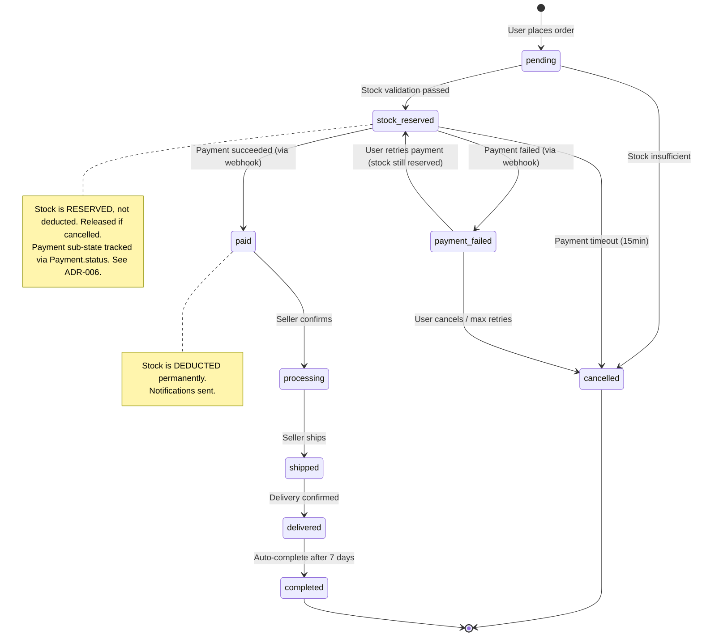
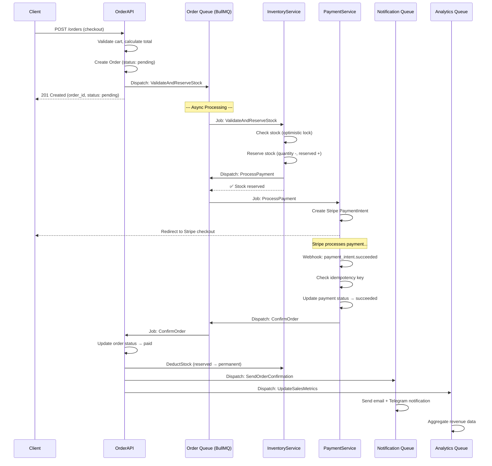
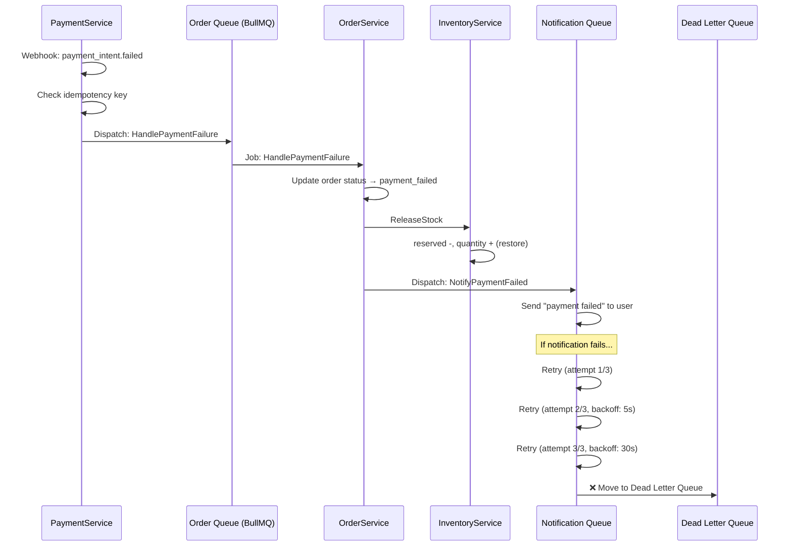
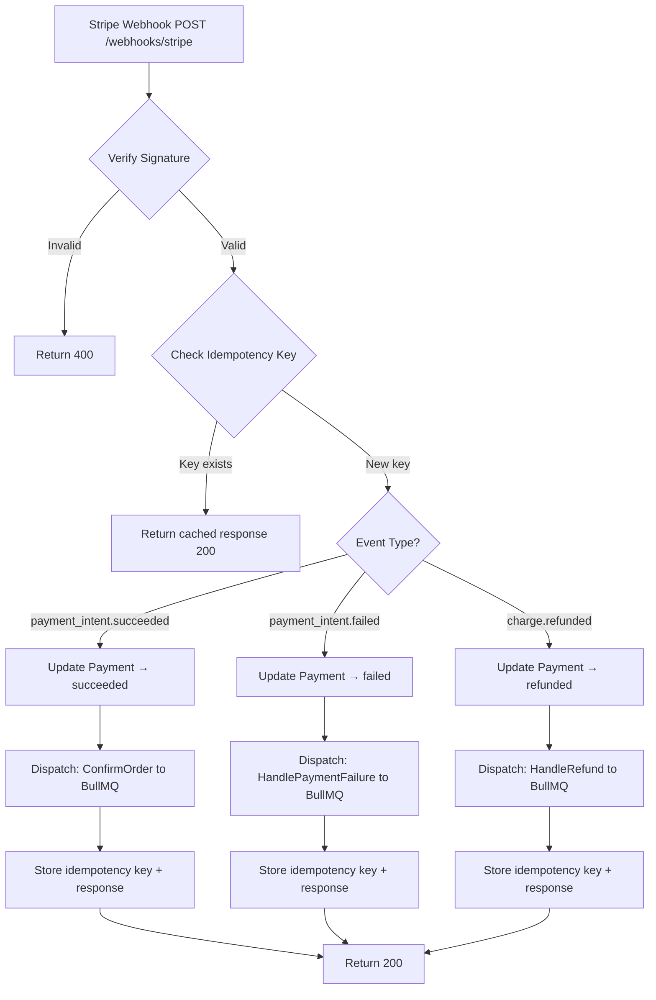

# Ordex — Event Flows

> Event-driven Architecture | BullMQ Pipeline | Failure Handling

## 1. Order Lifecycle — State Machine



---

## 2. Core Event Flow — Order Pipeline

### 2.1 Happy Path (Payment Success)



### 2.2 Failure Path (Payment Failed)



---

## 3. BullMQ Queue Architecture

### 3.1 Queue Definitions

| Queue Name            | Purpose                               | Retry | Backoff                     | DLQ |
| --------------------- | ------------------------------------- | ----- | --------------------------- | --- |
| `order.stock`         | Stock validation & reservation        | 3     | Exponential (1s, 5s, 30s)   | ✅  |
| `order.payment`       | Payment processing                    | 2     | Fixed (10s)                 | ✅  |
| `order.confirm`       | Order confirmation + stock deduction  | 3     | Exponential                 | ✅  |
| `order.cancel`        | Order cancellation + stock release    | 5     | Exponential                 | ✅  |
| `notification.send`   | Email/Telegram dispatch               | 3     | Exponential (5s, 30s, 120s) | ✅  |
| `analytics.aggregate` | Revenue/sales data aggregation        | 2     | Fixed (60s)                 | ❌  |
| `system.cleanup`      | Expired idempotency keys, stale carts | 1     | —                           | ❌  |

### 3.2 Job Configuration

```typescript
// Ví dụ: Order stock validation job
{
  name: 'validate-and-reserve-stock',
  data: {
    orderId: 'order_uuid',
    items: [
      { variantId: 'variant_uuid', quantity: 2 }
    ],
    correlationId: 'req_uuid'  // Tracing
  },
  opts: {
    attempts: 3,
    backoff: {
      type: 'exponential',
      delay: 1000  // 1s → 5s → 30s
    },
    removeOnComplete: { age: 86400 },  // Keep 24h
    removeOnFail: false  // Keep failed for inspection
  }
}
```

### 3.3 Dead Letter Queue Handling

Khi job fail hết số retry:

1. Job tự động vào DLQ (`__dlq` suffix)
2. Admin Dashboard hiển thị DLQ jobs
3. Admin có thể: **Retry** (push lại queue gốc) hoặc **Discard** (mark resolved)
4. Alert qua Telegram khi DLQ có job mới

---

## 4. Payment Webhook Flow + Idempotency

### 4.1 Stripe Webhook Processing



### 4.2 Idempotency Key Flow

```typescript
// Pseudocode
async handleWebhook(event: StripeEvent) {
  const idempotencyKey = `stripe_${event.id}`;

  // 1. Check if already processed
  const existing = await idempotencyKeyService.find(idempotencyKey);
  if (existing) {
    return { status: existing.responseCode, body: existing.responseBody };
  }

  // 2. Process the event
  const result = await processPaymentEvent(event);

  // 3. Store the result
  await idempotencyKeyService.create({
    key: idempotencyKey,
    resourceType: 'payment_webhook',
    resourceId: result.paymentId,
    responseCode: 200,
    responseBody: { status: 'processed' },
    expiresAt: addHours(new Date(), 24),
  });

  return result;
}
```

---

## 5. Saga Pattern — Order Compensation

Khi 1 step trong pipeline fail, các step trước đó phải được "undo" (compensation):

### 5.1 Compensation Table

| Step                 | Action                 | Compensation (if fail)              |
| -------------------- | ---------------------- | ----------------------------------- |
| 1. Validate Stock    | Check availability     | — (no side effect)                  |
| 2. Reserve Stock     | `reserved += quantity` | `reserved -= quantity`              |
| 3. Process Payment   | Charge via Stripe      | Refund via Stripe                   |
| 4. Confirm Order     | `status → paid`        | `status → cancelled`                |
| 5. Deduct Stock      | `quantity -= reserved` | `quantity += amount` (restore)      |
| 6. Send Notification | Email/Telegram         | — (notification is fire-and-forget) |

### 5.2 Compensation Flow Example

```
Step 1: ✅ Stock validated
Step 2: ✅ Stock reserved
Step 3: ❌ Payment failed (Stripe timeout)

→ Compensation triggered:
  - Undo Step 2: Release reserved stock
  - Undo Step 1: No action needed
  - Update order: status → payment_failed
  - Notify user: "Payment failed, please try again"
```

---

## 6. Scheduled Jobs (BullMQ Cron)

| Job                          | Schedule      | Purpose                                        |
| ---------------------------- | ------------- | ---------------------------------------------- |
| `cleanup-expired-carts`      | Every 6h      | Remove carts inactive > 7 days                 |
| `cleanup-idempotency-keys`   | Daily 3:00 AM | Delete keys older than 24h                     |
| `release-stale-reservations` | Every 30min   | Release stock reserved > 15min without payment |
| `aggregate-daily-analytics`  | Daily 1:00 AM | Revenue, order count, conversion rate          |
| `send-daily-seller-report`   | Daily 8:00 AM | Email seller summary                           |

---

## 7. Event Catalog

Complete list of domain events in the system:

| Event                 | Publisher    | Consumer(s)                    | Payload                           |
| --------------------- | ------------ | ------------------------------ | --------------------------------- |
| `order.created`       | Order Module | Inventory                      | `{orderId, items[]}`              |
| `stock.reserved`      | Inventory    | Order                          | `{orderId, reservationId}`        |
| `stock.insufficient`  | Inventory    | Order                          | `{orderId, variantId, available}` |
| `stock.released`      | Inventory    | Analytics                      | `{orderId, items[]}`              |
| `payment.processing`  | Payment      | Order                          | `{orderId, paymentId, provider}`  |
| `payment.succeeded`   | Payment      | Order, Notification, Analytics | `{orderId, paymentId, amount}`    |
| `payment.failed`      | Payment      | Order, Notification            | `{orderId, paymentId, reason}`    |
| `payment.refunded`    | Payment      | Order, Notification, Inventory | `{orderId, amount}`               |
| `order.confirmed`     | Order        | Notification                   | `{orderId, userId}`               |
| `order.shipped`       | Order        | Notification                   | `{orderId, trackingNumber}`       |
| `order.completed`     | Order        | Analytics                      | `{orderId, total}`                |
| `order.cancelled`     | Order        | Inventory, Notification        | `{orderId, reason}`               |
| `notification.sent`   | Notification | —                              | `{notificationId, channel}`       |
| `notification.failed` | Notification | DLQ Handler                    | `{notificationId, error}`         |
